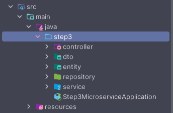
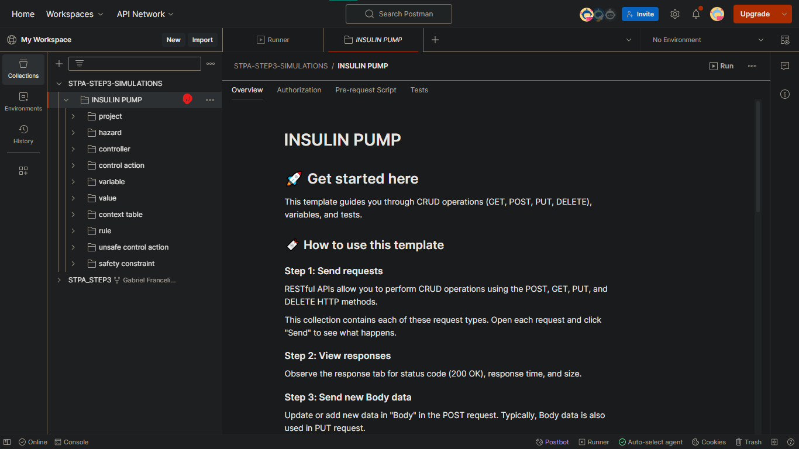
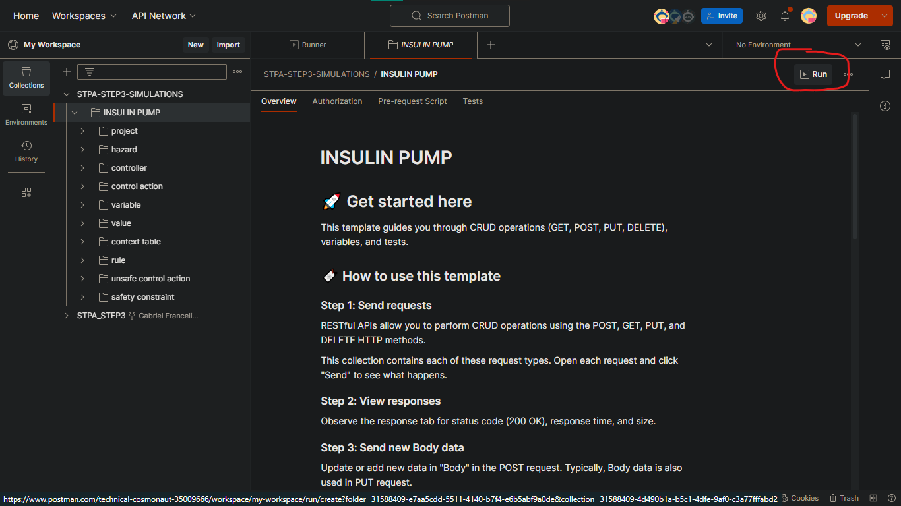
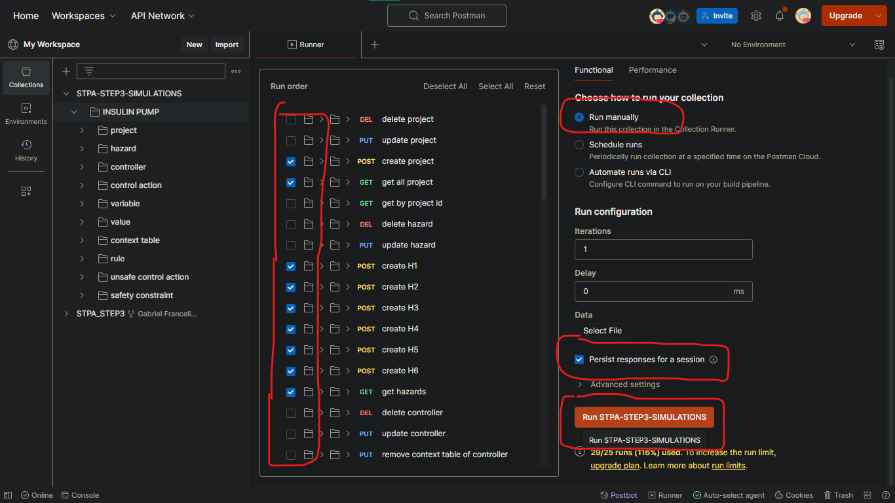
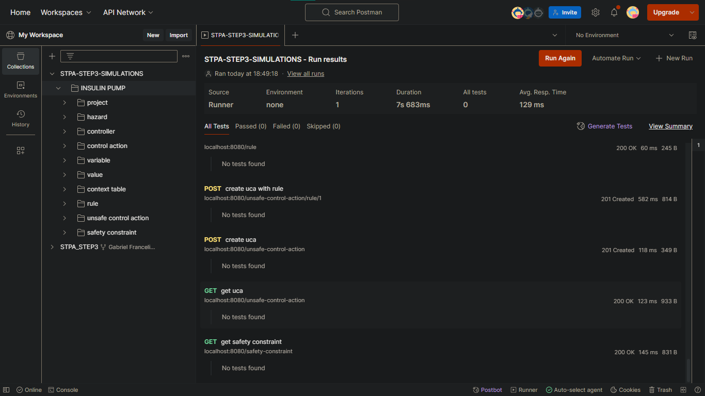
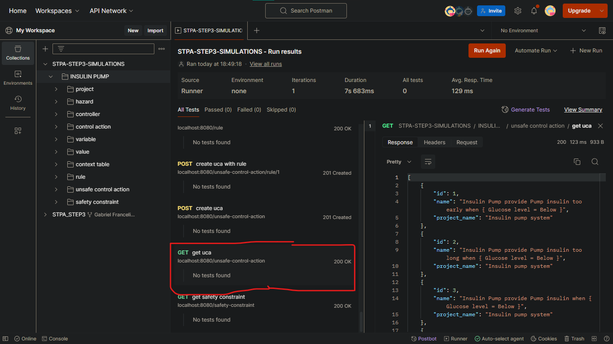

# Microsserviço para STPA (Step 3) - Back-End

## Descrição

Implementação da API (back-end) do microsserviço para o passo 3 da técnica STPA.

---

## Tecnologias Utilizadas

<div style="display: flex; gap: 7px; flex-wrap: wrap;">
    
    
    
    
    
</div>

### Configuração do Ambiente

- JDK 21 (Java Development Kit)
- Maven 3.8.1
- MySQL Server 8.0.25
- Spring Boot 3.1.5
- Postman Agent

---

## Estrutura do Projeto
O projeto está estruturado da seguinte forma:



---

## Instruções para Build e Execução

Para executar este projeto localmente, siga os passos abaixo:

1. **Clone o repositório:**

    ```shell
       git clone https://github.com/gabriel-piva/step3.git
    ```

2. **Configure o banco de dados:**
    - Crie um banco de dados no MySQL para a aplicação com o nome de `step3`.
    - Configure as credenciais de acesso ao banco no arquivo `application.properties` do projeto.
      - O padrão definido usa `user: root` e `senha: root`, com o MySQL na porta `3306`.
      - A aplicação utiliza `spring.jpa.hibernate.ddl-auto=update` para criar as tabelas no banco automaticamente.
      - Para alterar estas e outras propriedades, acesse a documentação: [Application Properties](https://docs.spring.io/spring-boot/docs/current/reference/html/application-properties.html).


3. **Executar a aplicação:**
   - A aplicação inicia na porta `8080`.
   - Você pode executar a aplicação usando a IDE de sua preferência ou pelo Maven. 
   - Para executar pelo Maven, execute o comando abaixo no diretório raiz do projeto:
     ```shell
        mvn spring-boot:run
     ```

Após a execução da aplicação, você pode testar os endpoints da API usando o Postman.

---

## Testando a API com o Postman


Você pode testar e explorar as funcionalidades da API com o Postman.

Criamos uma coleção no Postman que apresenta todos os endpoints da API e também cria um exemplo para testes, utilizando o sistema `Insulin Pump`, amplamente utilizado na literatura STPA.


- **Coleção no Postman:**
    - Você pode acessar a coleção de requisições aqui: [Coleção no Postman](https://www.postman.com/technical-cosmonaut-35009666/workspace/my-workspace/folder/31588409-e7aa5cdd-5511-4140-b7f4-e6b5abf9a0de?action=share&creator=31588409&ctx=documentation).


- **Como Utilizar:**
    - Faça um fork do workspace para ter uma cópia em seu próprio ambiente no Postman Online, permitindo a edição, teste e uso das requisições conforme necessário.
    - Para enviar requisições com o Postman Online, é necessário ter instalado o [Postman Agent](https://www.postman.com/downloads/postman-agent/).
    - Se preferir, baixe a coleção como um arquivo JSON e importe-o no Postman ou em outras ferramentas compatíveis.

Na coleção, há duas pastas:

1. `STPA_STEP3`: Contém uma pasta para cada entidade da aplicação, proporcionando acesso aos diversos endpoints para personalizar e testar as requisições de acordo com suas necessidades.


2. `STPA-STEP3-SIMULATIONS`: Possui uma pasta chamada Insulin Pump que contém todas as requisições necessárias para criar automaticamente um exemplo no banco de dados. 

    Para isso, acesse a pasta, vá até a opção Runner, arraste a pasta Insulin Pump para a área de execução, marque as requisições desejadas e execute. Assim, o exemplo da bomba de insulina será criado automaticamente, permitindo a verificação das saídas e a realização de novos testes e requisições.
---
### Passo a passo

1. Clique na coleção `INSULIN PUMP` dentro da coleção `STPA-STEP3-SIMULATIONS`
    
2. Clique no botão `Run` localizado no canto superior direito
    
3. Selecione quais as requisições que deseja executar e as configurações de execução, após isso clique no botão laranja para executar
    
4. Após a execução, você pode verificar os resultados das requisições e os dados inseridos no banco de dados
    
5. Para ter uma visão detalhada de cada requisição, é só clicar em cima dela e vai aparecer uma tela a direita com as informações
    

## Autores
<div style="display: flex; gap: 8px;">
    <a href="https://github.com/gabriel-francelino" target="_blank"></a>
    <a href="https://github.com/gabriel-piva" target="_blank"></a>
    <a href="https://github.com/pagliares" target="_blank"></a>
    <a href="https://github.com/gabriel-nadalin" target="_blank"></a>
</div>

---