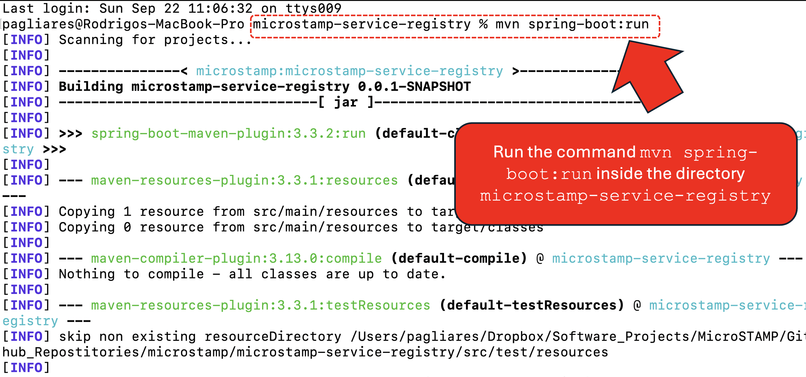
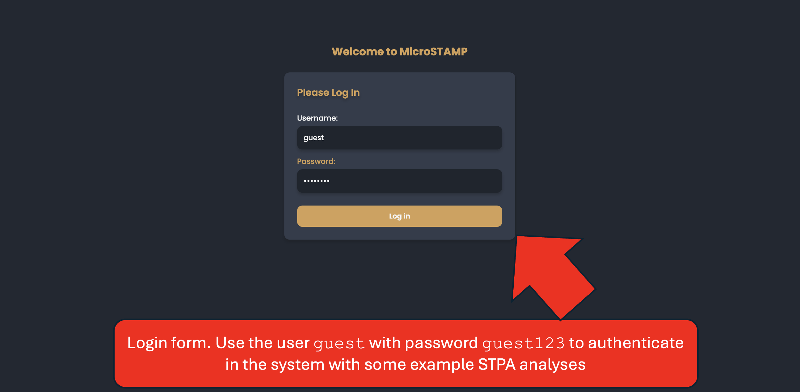
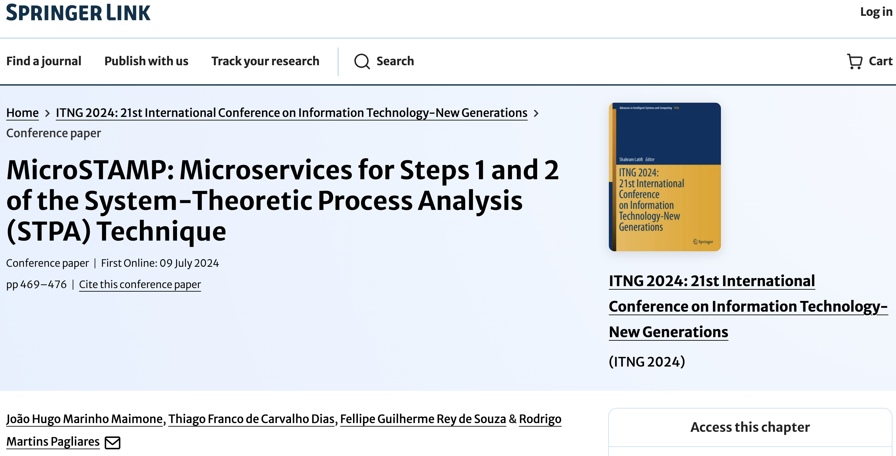
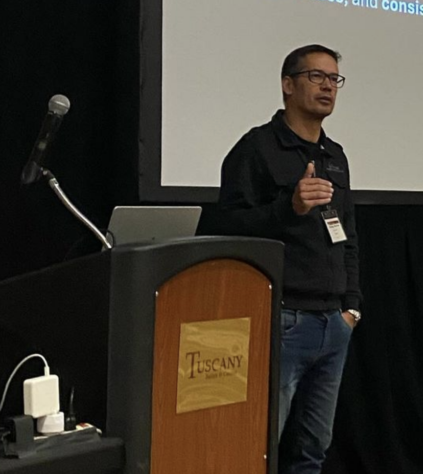
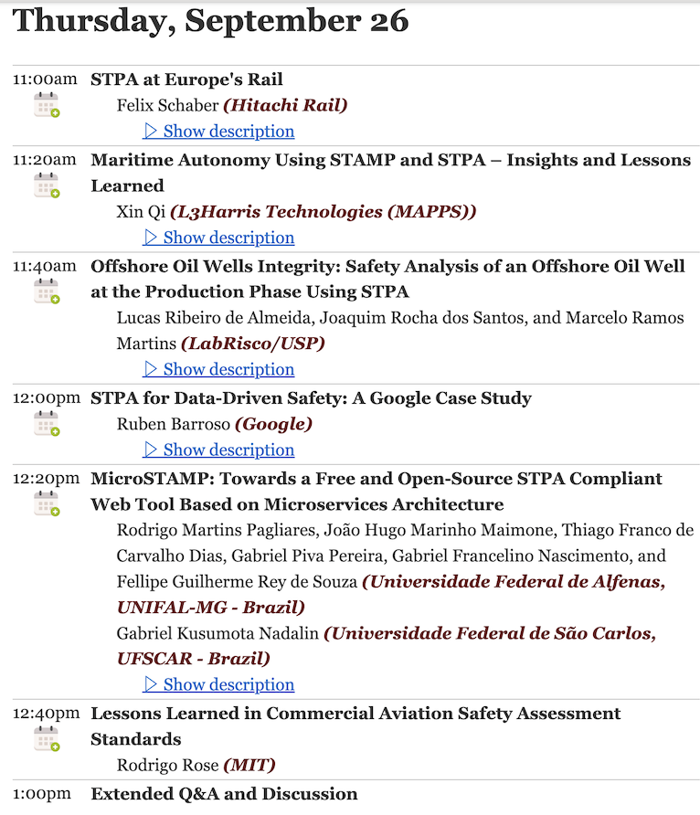

# 

Microservices for STPA (System-Theoretic Process Analysis)

## Description

This repository contains the source code for MicroSTAMP, a web application based on microservices architecture to support STPA. Out of the 4 steps of STPA, MicroSTAMP supports steps 1, 2, and 3. We estimate to release the microservice implementation for Step 4 by **January, 2025**.

## Table of Contents

-   [Architecture Overview](#architecture-overview)
-   [How to Run MicroSTAMP](#how-to-run-microstamp)
-   [MicroSTAMP Microservices](#microstamp-microservices)
-   [Contributing Guidelines](#contributing-guidelines)
-   [Lead developers](#lead-developers)
-   [Publications](#publications)
-   [Talks](#talks)
-   [Contact Information](#contact-information)

## Architecture Overview

<figure>
    
    <figcaption><strong>Figure: MicroSTAMP architecture.</strong></figcaption>
</figure>

### Ports

| Microservice                    | Port |
| ------------------------------- | ---- |
| microstamp-step1                | 8091 |
| microstamp-step2                | 8090 |
| microstamp-step3                | 8080 |
| microstamp-service-registry     | 8761 |
| microstamp-authorization-server | 9000 |
| microstamp-api-gateway          | 9191 |

| User Interface | Port |
| -------------- | ---- |
| microstamp-ui  | 5173 |

### Technologies

#### Microservices

<div style="display: flex; gap: 7px; flex-wrap: wrap;">
    
    
    
    
    
    
</div>

#### User Interface

<div style="display: flex; gap: 7px; flex-wrap: wrap;">
    
    
    
</div>
<br>

[⬆️ Back to Top](#table-of-contents)

## How to Run MicroSTAMP

This section provides a guide on how to run MicroSTAMP via the command-line using Maven.

#### Prerequisites

To build and run the application, you'll need the following:

-   [JDK 21](https://www.oracle.com/java/technologies/downloads/#java21)
-   [MySQL 8.0](https://dev.mysql.com/downloads/mysql) or higher
-   [Apache Maven](https://maven.apache.org/)
-   [Node.js and NPM](https://nodejs.org/pt/download/package-manager)

#### Command-line setup

<details> 
<summary><strong>Set up MySQL Databases</strong></summary>
<br>
  Ensure that MySQL is installed and running on your machine. The default port for MySQL is <code>3306</code>. If MySQL is not installed, you can download it from the official MySQL website:

-   [Download MySQL](https://dev.mysql.com/downloads/mysql/)

**Creating the Databases**

Once MySQL is installed and running, follow the steps below to create the necessary databases for the project.

1. Open a terminal or command prompt.
2. Log in to MySQL using the following command:

    ```
      mysql -u root -p
    ```

3. Create the required databases by running the following SQL commands:

    ```
    CREATE DATABASE microstamp;
    CREATE DATABASE step1;
    CREATE DATABASE step2;
    CREATE DATABASE step3;
    ```

That's it! Your MySQL databases are now set up and ready to use.

</details>

<details> 
<summary><strong>2. Clone the Project</strong></summary>

1.  Open a terminal or command prompt.
2.  Navigate to the directory where you want to clone the project.
3.  Clone the project repository using the following command:

    ```
    git clone https://github.com/Micro-STAMP/microstamp.git
    ```

</details>

<details>
<summary><strong>3. Run the Microservices</strong></summary>

##### 1. Run the **microstamp-service-registry** microservice

We recommend running this microservice before all others, to ensures that each microservice can register itself properly, making communication between them more reliable.

To run this microservice, open a terminal or command prompt, navigate to its directory, and execute the following command:

```
mvn spring-boot:run
```

 <figure>
   
     <figcaption><strong>Figure: Running the service registry in the command-line.</strong></figcaption>
 </figure>

<br>
<p>Alternatively, you can also run the microservices directly within an IDE. We use **IntelliJ IDEA 2023.3.5 Ultimate Edition**, but feel free to use any IDE of your choice that supports Spring Boot.</p>

##### 2. Run the Remaining Microservices
Follow the same steps to run the remaining microservices. For each one, navigate to its respective directory and execute <code>mvn spring-boot:run</code> or use your IDE.

##### 3. Run the User Interface microstamp-ui

With the microservices running, open a new terminal window to execute the microstamp-ui. Navigate to its directory and run:

```
   npm i

   npm run dev
```

-   `npm i` is needed only when first running the UI.
-   The user interface will open at the URL http://127.0.0.1:5173.
-   You can now access the MicroSTAMP frontend!

We created a user with some example analyses to provide a global picture of how MicroSTAMP supports STPA.

<figure>
  
	<figcaption><strong>Figure: Authenticating with the user guest.</strong></figcaption>
</figure>

<br>
<p>The user guest has some pre-stored STPA analyses and control structure from Step 2 of STPA.</p>
<br>

<figure>
  
	<figcaption><strong>Figure: Pre-stored STPA analyses page from user guest.</strong></figcaption>
</figure>

</details>

[⬆️ Back to Top](#table-of-contents)

## MicroSTAMP Microservices

If you wish to understand more in-depth details about any specific microservice, you can refer to its respective directory.
Each directory contains a comprehensive description of its role and implementation within the MicroSTAMP system. Below is a table with links to the corresponding folders for each microservice:

| Microservice                         | Description                                                                   | Link                                                                                                        |
|--------------------------------------|-------------------------------------------------------------------------------|-------------------------------------------------------------------------------------------------------------|
| **MicroSTAMP Service Registry**      | Registers instances of the microservices for discovery and communication.     | [Service Registry](https://github.com/Micro-STAMP/microstamp/tree/main/microstamp-service-registry)         |
| **MicroSTAMP API Gateway**           | The main entry point, delegating requests to the corresponding microservices. | [API Gateway](https://github.com/Micro-STAMP/microstamp/tree/main/microstamp-api-gateway)                   |
| **MicroSTAMP Authorization Server**  | Controls authorization with OAuth2 and authentication with OpenID.            | [Authorization Server](https://github.com/Micro-STAMP/microstamp/tree/main/microstamp-authorization-server) |
| **MicroSTAMP STPA Step 1**           | Handles the **Define Purpose of the Analysis** step.                          | [STPA Step 1](https://github.com/Micro-STAMP/microstamp/tree/main/microstamp-step1)                         |
| **MicroSTAMP STPA Step 2**           | Handles the **Model the Control Structure** step.                             | [STPA Step 2](https://github.com/Micro-STAMP/microstamp/tree/main/microstamp-step2)                         |
| **MicroSTAMP STPA Step 3**           | Handles the **Identify Unsafe Control Actions** step.                         | [STPA Step 3](https://github.com/Micro-STAMP/microstamp/tree/main/microstamp-step3)                         |

Each microservice is detailed in its respective repository directory, outlining its purpose, key functionalities, and implementation.

Additionally, you can find the repository for the MicroSTAMP User Interface here: [MicroSTAMP UI](https://github.com/Micro-STAMP/microstamp/tree/main/microstamp-ui).

_Note: Some of the specific READMEs are still under development. If you find that a README does not yet exist, it will be added shortly._

[⬆️ Back to Top](#table-of-contents)

## Contributing Guidelines

You're welcome to contribute to the MicroSTAMP project! If you find any bugs or have suggestions for new features, please feel free to submit them via pull requests or contact us via email.

[⬆️ Back to Top](#table-of-contents)

## Lead Developers

<div style="display: flex; gap: 8px; flex-wrap: wrap">
    <a href="https://github.com/JoaoHugo" target="_blank"></a>
    <a href="https://github.com/gabriel-francelino" target="_blank"></a>
    <a href="https://github.com/gabriel-piva" target="_blank"></a>
    <a href="https://github.com/pagliares" target="_blank"></a>
    <a href="https://github.com/felliperey" target="_blank"></a>
    <a href="https://github.com/gabriel-nadalin" target="_blank"></a>
   <a href="https://github.com/ThiagoFranco0202" target="_blank"></a>
</div>
<br>

[⬆️ Back to Top](#table-of-contents)

## Publications

Maimone, João Hugo Marinho, Thiago Franco de Carvalho Dias, Fellipe Guilherme Rey de Souza, and Rodrigo Martins Pagliares. 
"**MicroSTAMP: Microservices for Steps 1 and 2 of the System-Theoretic Process Analysis (STPA) Technique**." 
In _International Conference on Information Technology-New Generations_, pp. 469-476. Cham: Springer Nature Switzerland, 2024.

 <a href="https://link.springer.com/chapter/10.1007/978-3-031-56599-1_59" target="_blank">
   
 </a>

<br>

[⬆️ Back to Top](#table-of-contents)

## Talks

1. Maimone, João Hugo Marinho, Thiago Franco de Carvalho Dias, Fellipe Guilherme Rey de Souza, and Rodrigo Martins Pagliares. "**MicroSTAMP: Microservices for Steps 1 and 2 of the System-Theoretic Process Analysis (STPA) Technique**." In International Conference on Information Technology-New Generations, Las Vegas, NV, USA. April, 2024.

<figure style="width: 100%">
  
  <figcaption style="font-size: small;"><strong>Figure: Rodrigo Martins Pagliares at ITNG 2024</strong></figcaption>
</figure>

<p></p><br>

2. "**MicroSTAMP: Towards a Free and Open-Source STPA Compliant Web Tool Based on Microservices Architecture**", STAMP Workshop, MIT Partnership for Systems Approaches to Safety and Security (PSASS), September, 2024.

 <a href="https://psas.scripts.mit.edu/home/2024-stamp-workshop-program-virtual/">
     
 </a>

[⬆️ Back to Top](#table-of-contents)

## Contact Information

Rodrigo Martins Pagliares<br>
rodrigo.pagliares@unifal-mg.edu.br<br>
Universidade Federal de Alfenas - UNIFAL<br>
Computer Science Department<br>
Av. Jovino Fernandes Sales, 2600 – Santa Clara, Alfenas/MG - Brazil<br>
CEP: 37133-840<br>
Prédio C – 3º andar (Building C, Third Floor)<br>

[⬆️ Back to Top](#table-of-contents)
