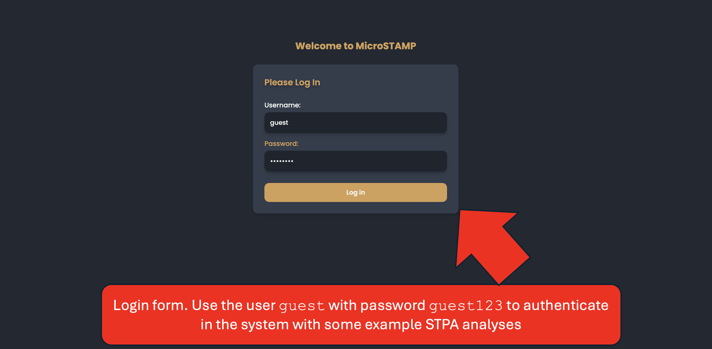
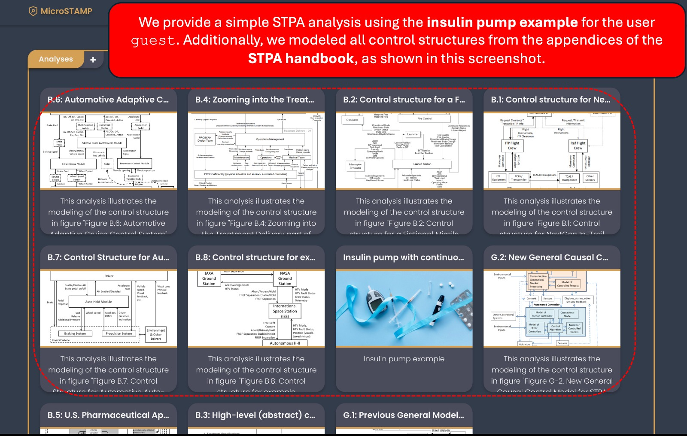
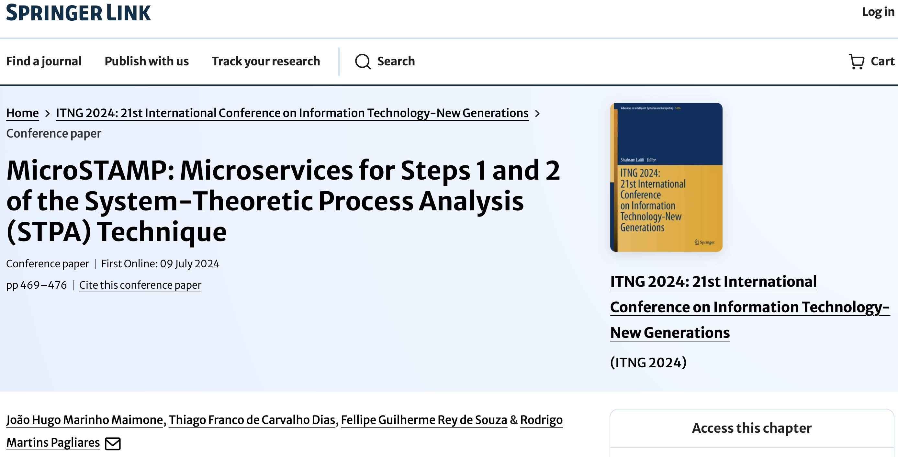
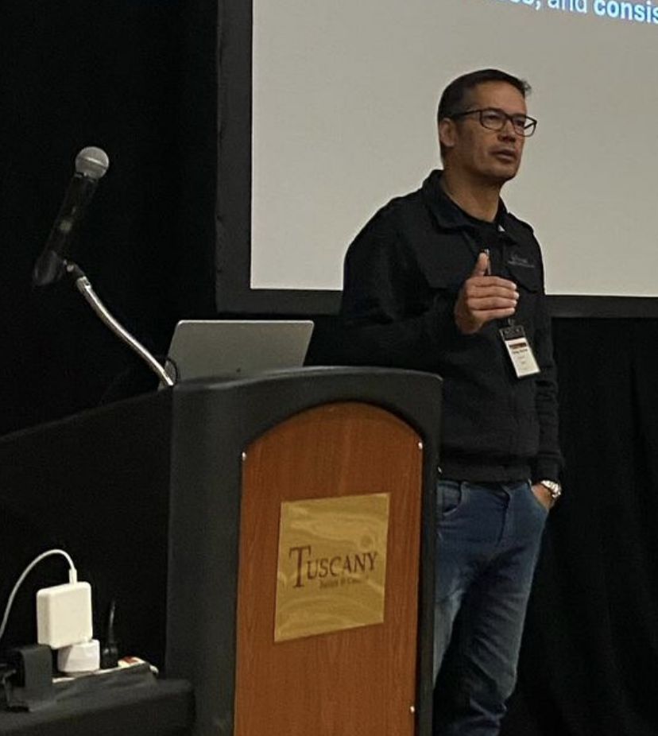
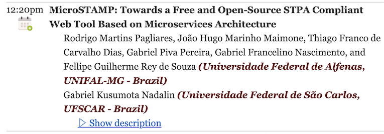
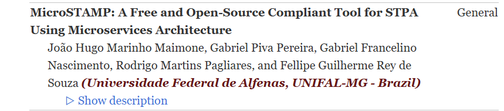

# 

**_Microservices for STPA (System-Theoretic Process Analysis)_**

<br>

[](https://github.com/Micro-STAMP/microstamp/stargazers)
[](https://github.com/Micro-STAMP/microstamp/fork)
[](https://github.com/Micro-STAMP/microstamp/issues)
[](https://opensource.org/licenses/MIT)

## Description

This repository contains the source code for **MicroSTAMP**, a free and open-source **STPA** compliant tool based on a **microservices architecture**.

**MicroSTAMP** currently supports all four steps of STPA, including two different approaches for Step 4: the Handbook Approach, which follows the standard definition from the [STPA Handbook](https://psas.scripts.mit.edu/home/get_file.php?name=STPA_Handbook.pdf), and the Formal Approach, based on [Formally Developing Loss Scenarios](https://youtu.be/hp-KBjIBmrI?si=anK9-GYa8eFk1_2C), which introduces a formalized method for identifying loss scenarios.

Beyond step support, MicroSTAMP integrates a unified front-end to access all services, offers preloaded example analyses, and enables PDF export for each step with embedded navigation hyperlinks. Its microservices-based architecture also provides scalability, service discovery, and secure access through OAuth2 and OpenID.

## Table of Contents

-   [Architecture Overview](#architecture-overview)
-   [MicroSTAMP Microservices](#microstamp-microservices)
-   [How to Run MicroSTAMP](#how-to-run-microstamp)
-   [Contributing Guidelines](#contributing-guidelines)
-   [Lead developers](#lead-developers)
-   [Publications](#publications)
-   [Talks](#talks)
-   [Contact Information](#contact-information)

## Architecture Overview

<figure>
    
    <figcaption><strong>Figure: MicroSTAMP architecture.</strong></figcaption>
</figure>

The MicroSTAMP architecture is based on independent **microservices**, each responsible for a specific part of the STPA technique or for supporting the system infrastructure. This design promotes scalability, reusability and easy integration with other STPA tools. Microservices communicate via REST through the API Gateway; each STPA step service manages its own data store to keep bounded contexts and improve modularity and traceability.

**Key components**

-   **MicroSTAMP UI**: unified front-end that consumes the microservice APIs.
-   **API Gateway**: single entry point that routes requests to services.
-   **Authorization Server**: handles authentication/authorization (OAuth2/OpenID).
-   **Service Registry**: service discovery (registers service instances for inter-service communication).
-   **STPA Step Microservices**: microservice for the STPA steps; each has its own database:
    -   Step 1 — Define Purpose of the Analysis
    -   Step 2 — Model the Control Structure
    -   Step 3 — Identify Unsafe Control Actions (Context Table + Rule-based approach)
    -   Step 4 — Identify Loss Scenarios (Handbook)
    -   Step 4 — Identify Loss Scenarios (Formal Approach)

### Ports

| Microservice                    | Port |
| ------------------------------- | ---- |
| microstamp-step1                | 8101 |
| microstamp-step2                | 8102 |
| microstamp-step3                | 8103 |
| microstamp-step4                | 8104 |
| microstamp-step4-new            | 8105 |
| microstamp-api-gateway          | 8000 |
| microstamp-authorization-server | 8001 |
| microstamp-service-registry     | 8002 |

| User Interface | Port |
| -------------- | ---- |
| microstamp-ui  | 3000 |

### Technologies

#### Microservices

<div style="display: flex; gap: 7px; flex-wrap: wrap;">
    
    
    
    
    
    
</div>

#### User Interface

<div style="display: flex; gap: 7px; flex-wrap: wrap;">
    
    
    
    
</div>
<br>

[⬆️ Back to Top](#table-of-contents)

## MicroSTAMP Microservices

MicroSTAMP is composed of 8 core microservices: 3 services that handle the underlying architecture, and 5 STPA step services that each implement a specific step of the STPA technique (including one for each step 4 approach).

For all microservices, you can access the specific source code by visiting each service's dedicated directory.

| Microservice                                 | Description                                                                                                                    | Link                                                                                                        |
| -------------------------------------------- | ------------------------------------------------------------------------------------------------------------------------------ | ----------------------------------------------------------------------------------------------------------- |
| **MicroSTAMP Service Registry**              | Registers instances of the microservices for discovery and communication.                                                      | [Service Registry](https://github.com/Micro-STAMP/microstamp/tree/main/microstamp-service-registry)         |
| **MicroSTAMP API Gateway**                   | The main entry point, delegating requests to the corresponding microservices.                                                  | [API Gateway](https://github.com/Micro-STAMP/microstamp/tree/main/microstamp-api-gateway)                   |
| **MicroSTAMP Authorization Server**          | Controls authorization with OAuth2 and authentication with OpenID.                                                             | [Authorization Server](https://github.com/Micro-STAMP/microstamp/tree/main/microstamp-authorization-server) |
| **MicroSTAMP STPA Step 1**                   | Implements the **Define Purpose of the Analysis** step.                                                                        | [STPA Step 1](https://github.com/Micro-STAMP/microstamp/tree/main/microstamp-step1)                         |
| **MicroSTAMP STPA Step 2**                   | Implements the **Model the Control Structure** step.                                                                           | [STPA Step 2](https://github.com/Micro-STAMP/microstamp/tree/main/microstamp-step2)                         |
| **MicroSTAMP STPA Step 3**                   | Implements the **Identify Unsafe Control Actions** step, using context tables and rules.                                       | [STPA Step 3](https://github.com/Micro-STAMP/microstamp/tree/main/microstamp-step3)                         |
| **MicroSTAMP STPA Step 4 (Handbook)**        | Implements the **Identify Loss Scenarios** step using the standard STPA Handbook Approach.                                     | [STPA Step 4 (Handbook)](https://github.com/Micro-STAMP/microstamp/tree/main/microstamp-step4)              |
| **MicroSTAMP STPA Step 4 (Formal Approach)** | Implements the **Identify Loss Scenarios** step using the [Formal Approach](https://youtu.be/hp-KBjIBmrI?si=AqTFvtEHjV3ZX-Ra). | [STPA Step 4 (Formal Approach)](https://github.com/Micro-STAMP/microstamp/tree/main/microstamp-step4-new)   |

Additionally, you can find the directory for the MicroSTAMP User Interface here: [MicroSTAMP UI](https://github.com/Micro-STAMP/microstamp/tree/main/microstamp-ui).

[⬆️ Back to Top](#table-of-contents)

## How to Run MicroSTAMP

This section provides two options for running MicroSTAMP: Option 1 uses Maven and runs the services locally, while Option 2 uses Docker for a containerized setup.

Before proceeding, clone the project repository to your local machine:

<details>
<summary><strong>Clone the Project</strong></summary>

1.  Open a terminal or command prompt.
2.  Navigate to the directory where you want to clone the project.
3.  Clone the project repository using the following command:

    ```
    git clone https://github.com/Micro-STAMP/microstamp.git
    ```

</details>

Once the repository is cloned, you can choose one of the two options below to run MicroSTAMP.

<details>
<summary><strong>Option 1: Run MicroSTAMP with Maven (Local Setup)</strong></summary>
This option runs the microservices and UI locally using Maven and Node.js.

#### Prerequisites

To build and run the application, you'll need the following:

-   [JDK 21](https://www.oracle.com/java/technologies/downloads/#java21)
-   [MySQL 8.0](https://dev.mysql.com/downloads/mysql) or higher
-   [Apache Maven](https://maven.apache.org/)
-   [Node.js and NPM](https://nodejs.org/pt/download/package-manager)

#### Command-line setup

<details> 
<summary><strong>1. Set up MySQL Databases</strong></summary>
<br>
  Ensure that MySQL is installed and running on your machine. The default port for MySQL is <code>3306</code>. If MySQL is not installed, you can download it from the official MySQL website:

-   [Download MySQL](https://dev.mysql.com/downloads/mysql/)

**Creating the Databases**

Once MySQL is installed and running, follow the steps below to create the necessary databases for the project.

1. Open a terminal or command prompt.
2. Log in to MySQL using the following command:

    ```
      mysql -u root -p
    ```

3. Create the required databases by running the following SQL commands:

    ```
    CREATE DATABASE microstamp;
    CREATE DATABASE step1;
    CREATE DATABASE step2;
    CREATE DATABASE step3;
    CREATE DATABASE step4;
    CREATE DATABASE step4new;
    ```

That's it! Your MySQL databases are now set up and ready to use.

</details>

<details>
<summary><strong>2. Run the Microservices</strong></summary>

##### 1. Run the **microstamp-service-registry** microservice

We recommend running this microservice before all others, to ensures that each microservice can register itself properly, making communication between them more reliable.

To run this microservice, open a terminal or command prompt, navigate to its directory, and execute the following command:

```
mvn spring-boot:run
```

<p></p><br>

Alternatively, you can also run the microservices directly within an IDE. We use IntelliJ IDEA Ultimate Edition, but feel free to use any IDE of your choice that supports Spring Boot.

##### 2. Run the Remaining Microservices

Follow the same steps to run the remaining microservices. For each one, navigate to its respective directory and execute <code>mvn spring-boot:run</code> or use your IDE.

##### 3. Run the User Interface microstamp-ui

With the microservices running, open a new terminal window to execute the microstamp-ui. Navigate to its directory and run:

```
npm i
npm run dev
```

-   `npm i` is needed only when first running the UI.
-   The user interface will open at the URL `http://127.0.0.1:3000`.
-   You can now access the MicroSTAMP frontend!

</details>
</details>

<p></p>

<details>
<summary><strong>Option 2: Run MicroSTAMP with Docker (Containerized Setup)</strong></summary>
This option runs MicroSTAMP using Docker, which simplifies the setup process by containerizing all services.

#### Set up Docker

Ensure Docker and Docker Compose are installed and running on your machine. If not, download and install them from the official Docker website:

-   [Download Docker](https://docs.docker.com/get-started/get-docker/)
-   [Download Docker Compose](https://docs.docker.com/compose/install/)

#### Run the Docker Compose file

1.  Open a terminal or command prompt.
2.  Navigate to the root directory of the cloned project.
3.  Run the following command to start all services:
    ```
    docker-compose up --build
    ```

This command will build and start all the microservices, the MySQL databases, and the UI.

#### Access the Application

-   The user interface will be available at: `http://127.0.0.1:3000`.
-   The microservices will be running on their respective ports as defined in the [Architecture Overview](#architecture-overview).
    <br>

</details>

Once MicroSTAMP is running (via either Option 1 or Option 2), you can explore the application using a pre-configured guest account.

<details>
<summary><strong>Exploring MicroSTAMP with the Guest User</strong></summary>

We created a user with some example analyses to provide a global picture of how MicroSTAMP supports STPA.
The user **guest** has some pre-stored STPA analyses and control structure from Step 2 of STPA.

<figure>
  
	<figcaption><strong>Figure: Authenticating with the user guest.</strong></figcaption>
</figure>

<p></p><br>

<figure>
  
	<figcaption><strong>Figure: Pre-stored STPA analyses page from user guest.</strong></figcaption>
</figure>

</details>

<br>

[⬆️ Back to Top](#table-of-contents)

## Contributing Guidelines

We welcome **contributions** to the MicroSTAMP project!  
If you find any bugs, have suggestions for improvements, or would like to add new features, please open an issue or submit a pull request.  
You can also contact us directly via email — contributions of any kind are appreciated.

[⬆️ Back to Top](#table-of-contents)

## Developers Team

<div style="display: flex; gap: 8px; flex-wrap: wrap">
    <a href="https://github.com/JoaoHugo" target="_blank">
        
    </a>
    <a href="https://github.com/gabriel-piva" target="_blank">
        
    </a>
    <a href="https://github.com/gabriel-francelino" target="_blank">
        
    </a>
    <a href="https://github.com/pagliares" target="_blank">
        
    </a>
    <a href="https://github.com/felliperey" target="_blank">
        
    </a>
    <a href="https://github.com/gabriel-nadalin" target="_blank">
        
    </a>
    <a href="https://github.com/ThiagoFranco0202" target="_blank">
        
    </a>
</div>
<br>

[⬆️ Back to Top](#table-of-contents)

## Publications

Maimone, João Hugo Marinho, Thiago Franco de Carvalho Dias, Fellipe Guilherme Rey de Souza, and Rodrigo Martins Pagliares.
"**MicroSTAMP: Microservices for Steps 1 and 2 of the System-Theoretic Process Analysis (STPA) Technique**."
In _International Conference on Information Technology-New Generations_, pp. 469-476. Cham: Springer Nature Switzerland, 2024.

 <a href="https://link.springer.com/chapter/10.1007/978-3-031-56599-1_59" target="_blank">
   
 </a>

<br>

[⬆️ Back to Top](#table-of-contents)

## Talks

1. Maimone, João Hugo Marinho, Thiago Franco de Carvalho Dias, Fellipe Guilherme Rey de Souza, and Rodrigo Martins Pagliares. "**MicroSTAMP: Microservices for Steps 1 and 2 of the System-Theoretic Process Analysis (STPA) Technique**." In International Conference on Information Technology-New Generations, Las Vegas, NV, USA. April, 2024.

<figure style="width: 100%">
  
  <figcaption style="font-size: small;"><strong>Figure: Rodrigo Martins Pagliares at ITNG 2024</strong></figcaption>
</figure>

<p></p><br>

2. "**MicroSTAMP: Towards a Free and Open-Source STPA Compliant Web Tool Based on Microservices Architecture**", STAMP Workshop, MIT Partnership for Systems Approaches to Safety and Security (PSASS), September, 2024.

 <a href="https://psas.scripts.mit.edu/home/2024-stamp-workshop-program-virtual/">
     
 </a>

 <p></p><br>

3. "**MicroSTAMP: A Free and Open-Source Compliant Tool for STPA Using Microservices Architecture**", STAMP Workshop, MIT Partnership for Systems Approaches to Safety and Security (PSASS), September, 2025.

 <a href="https://psas.scripts.mit.edu/home/2025-stamp-workshop-program/">
     
 </a>

[⬆️ Back to Top](#table-of-contents)

## Contact Information

Rodrigo Martins Pagliares<br>
rodrigo.pagliares@unifal-mg.edu.br<br>
Universidade Federal de Alfenas - UNIFAL<br>
Computer Science Department<br>

[⬆️ Back to Top](#table-of-contents)
