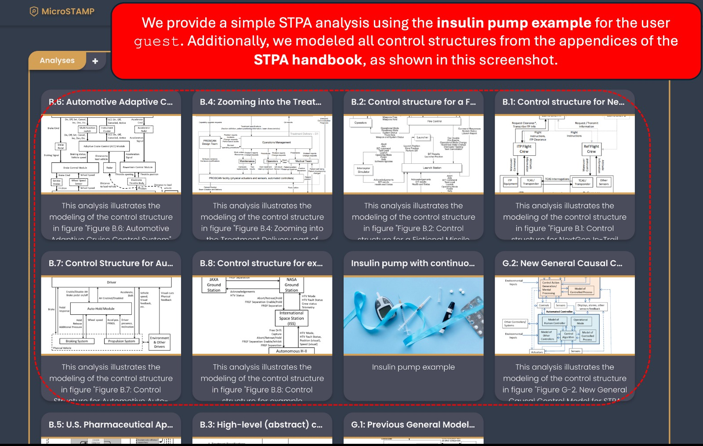

# 

Microservices for STPA (System-Theoretic Process Analysis)

## Description

This repository contains the source code for MicroSTAMP, a web application based on microservices architecture to support STPA. Out of the 4 steps of STPA, MicroSTAMP supports steps 1, 2, and 3. We estimate to release the microservice implementation for Step 4 by **January, 2025**.

## Table of Contents

-   [Architecture Overview](#architecture-overview)
-   [End Users Guide](#end-users-guide)
-   [Developers Guide](#developers-guide)
-   [MicroSTAMP Microservices](#microstamp-microservices)
-   [Contributing Guidelines](#contributing-guidelines)
-   [Lead developers](#lead-developers)
-   [Publications](#publications)
-   [Talks](#talks)
-   [Contact Information](#contact-information)

## Architecture Overview

<figure>
    
    <figcaption><strong>Figure: MicroSTAMP architecture.</strong></figcaption>
</figure>

### Ports

| Microservice                    | Port |
| ------------------------------- | ---- |
| microstamp-step1                | 8091 |
| microstamp-step2                | 8090 |
| microstamp-step3                | 8080 |
| microstamp-service-registry     | 8761 |
| microstamp-authorization-server | 9000 |
| microstamp-api-gateway          | 9191 |

| User Interface | Port |
| -------------- | ---- |
| microstamp-ui  | 5173 |

### Technologies

#### Microservices

<div style="display: flex; gap: 7px; flex-wrap: wrap;">
    
    
    
    
    
    
</div>

#### User Interface

<div style="display: flex; gap: 7px; flex-wrap: wrap;">
    
    
    
</div>
<br>

[⬆️ Back to Top](#table-of-contents)

## End Users Guide

This section describes two possible methods to run MicroSTAMP as an end user. If you are a software developer, see Section Developers Guide for guidance on how to run MicroSTAMP using IntelliJ IDEA.

### Method 1: Running MicroSTAMP with Docker

<details> 
<summary>How to Run MicroSTAMP with Docker?</summary>

#### Prerequisites

To build and run the application as an end-user, you’ll need:

-   Docker

#### Installation

1. Install Docker and Docker Compose

    Ensure you have Docker and Docker Compose installed on your machine:
   -   **Docker**: Download and install Docker from the [official Docker website](https://www.docker.com/).
   -   **Docker Compose**: It usually comes installed with Docker Desktop.


2. Open a Terminal

    Navigate to the directory where the `docker-compose.yaml` file is located.


3. Run Docker Compose
    Execute the following command to start the services defined in the `docker-compose.yaml` file:
    
    ```
    docker-compose up
    ```

    This command will:

    -   Build the Docker images if they are not already built.
    -   Start all the containers defined in the `docker-compose.yaml`.
</details>

### Method 2: Running MicroSTAMP with Maven

<details> 
<summary>How to Run MicroSTAMP with Maven?</summary>

#### Prerequisites

To build and run the application as a software developer, you'll need:

-   [JDK 21](https://www.oracle.com/java/technologies/downloads/#java21)
-   [MySQL 8.0](https://dev.mysql.com/downloads/mysql) or higher
-   [Apache Maven](https://maven.apache.org/)
-   [Node.js and NPM](https://nodejs.org/pt/download/package-manager)
-   [IntelliJ IDEA Ultimate Edition](https://www.jetbrains.com/idea/) (That's our IDE of choice, but you are free to use other IDEs as well).

#### Command-line setup

<details> 
<summary>1. Set up MySQL Databases</summary>
<br>
  Ensure that MySQL is installed and running on your machine. The default port for MySQL is <code>3306</code>. If MySQL is not installed, you can download it from the official MySQL website:

-   [Download MySQL](https://dev.mysql.com/downloads/mysql/)

Creating the Databases

Once MySQL is installed and running, follow the steps below to create the necessary databases for the project.

1. Open a terminal or command prompt.
2. Log in to MySQL using the following command:

    ```
      mysql -u root -p
    ```

3. Create the required databases by running the following SQL commands:

    ```
    CREATE DATABASE microstamp;
    CREATE DATABASE step1;
    CREATE DATABASE step2;
    CREATE DATABASE step3;
    ```

That's it! Your MySQL databases are now set up and ready to use.

</details>

<details> 
<summary>2. Clone the Project </summary>
<br>

Ensure that **Maven** is installed on your machine. You can download and install Maven from the official website:

-   [Download Maven](https://maven.apache.org/download.cgi)

Cloning the Project:

1.  Open a terminal or command prompt.
2.  Navigate to the directory where you want to clone the project.
3.  Clone the project repository using the following command:

    ```
    git clone https://github.com/Micro-STAMP/microstamp.git
    ```

</details>

<details> 
<summary>3. Run the Microservices</summary>

##### 1. Run the **microstamp-service-registry** microservice

 This microservices must be run **BEFORE** all other MicroSTAMP microservices. The reason is that the other microservices register themselves with the microstamp-service-registry microservice (that must be already running).
 
 To run this first microservice, go to a terminal or command-prompt, navigate to the directory and execute the command as illustrated

 ```
 mvn spring-boot:run
 ```

 <figure>
   
     <figcaption><strong>Figure: Running the service registry microservice with Apache Maven in the command-line.</strong></figcaption>
 </figure>

<br>

##### 2. Run the Remaining Microservices

Do the same process as the previous microservice for the remaining microservices. Access the folder of each of them and use the command <code>mvn spring-boot:run</code>.

##### 3. Run the User Interface microstamp-ui

With all the microservices running, open a new terminal window to execute the microstamp-ui.

   ```
      npm i 
      
      npm run dev
   ```

-  `npm i` is needed only when first running  the UI.
-  The user interface will open at the URL http://127.0.0.1:5173.
-  You can now access the MicroSTAMP frontend!

We created a user with some example analyses to provide a global picture of how MicroSTAMP supports STPA.

<figure>
  
	<figcaption>Authenticating with the user guest.</figcaption>
</figure>

The user guest has some pre-stored STPA analyses and control structure from Step 2 of STPA.

<figure>
  
	<figcaption>Authenticating with the user guest.</figcaption>
</figure>

</details>

</details>

[⬆️ Back to Top](#table-of-contents)

## Developers Guide

<details> 
<summary>Setup the Databases and Tools</summary>

Before running MicroSTAMP, ensure that your databases are properly configured. 
Follow the instructions provided in the [Method 2: Running MicroSTAMP with Maven](#method-2-running-microstamp-with-maven) to configure the necessary databases.
Additionally, make sure that all required tools and dependencies, such as Java, MySQL and Maven, are properly installed on your system.
After completing the setup, you can proceed to run the project.

</details>

<details>
<summary>Running MicroSTAMP within IntelliJ Idea</summary>

We use IntelliJ IDEA 2023.3.5 Ultimate Edition in this example of how to run MicroSTAMP. Below are the steps to get MicroSTAMP up and running.

1. Run the MicrostampServiceRegistryApplication microservice

There are several ways to run a microservice within IntelliJ. One possible way is illustrated in Figure 1.
   <figure> 
       
      <figcaption>Figure 1: Running the service registry microservice.</figcaption> 
   </figure>

After running the <code>MicrostampServiceRegistryApplication</code>, you can access the service registry administration page (Spring Eureka) at http://localhost:8761/ . At this point, no microservices are registered with the service registry.

2. Running the Remaining Microservices

Once the service registry is up and running, proceed to start the other microservices that you need. You can follow the same process used to run the service registry, simply selecting the main class of each microservice and running them via IntelliJ.

You can verify the microservices' registration by visiting the Eureka dashboard at http://localhost:8761/, where the services will be listed as they come online.

**Always** start the service-registry first to ensure all other microservices can register properly.

</details>

[⬆️ Back to Top](#table-of-contents)

## MicroSTAMP Microservices

If you wish to understand more in-depth details about any specific microservice, you can refer to the respective directory of each microservice. Each directory contains a comprehensive description of its role and implementation within the MicroSTAMP system. Below is a table with links to the corresponding folders for each microservice:

| Microservice                    | Description                                       | Link                                                                                           |
|----------------------------------|---------------------------------------------------|------------------------------------------------------------------------------------------------|
| **MicroSTAMP API Gateway**       | Manages routing, security, and load balancing.     | [API Gateway](https://github.com/Micro-STAMP/microstamp/tree/main/microstamp-api-gateway)       |
| **MicroSTAMP Service Registry**  | Tracks and manages service instances.             | [Service Registry](https://github.com/Micro-STAMP/microstamp/tree/main/microstamp-service-registry) |
| **MicroSTAMP STPA Step 1**       | Handles the first step of the STPA analysis.      | [STPA Step 1](https://github.com/Micro-STAMP/microstamp/tree/main/microstamp-step1)             |
| **MicroSTAMP STPA Step 2**       | Handles the second step of the STPA analysis.     | [STPA Step 2](https://github.com/Micro-STAMP/microstamp/tree/main/microstamp-step2)             |
| **MicroSTAMP STPA Step 3**       | Handles the third step of the STPA analysis.      | [STPA Step 3](https://github.com/Micro-STAMP/microstamp/tree/main/microstamp-step3)             |

Each microservice is detailed in its respective repository directory, outlining its purpose, key functionalities, and implementation.

Additionally, you can find the repository for the MicroSTAMP User Interface here: [MicroSTAMP UI](https://github.com/Micro-STAMP/microstamp/tree/main/microstamp-ui).

*Note: Some of the specific READMEs are still under development. If you find that a README does not yet exist, it will be added shortly.*

[⬆️ Back to Top](#table-of-contents)


## Contributing Guidelines

You're welcome to contribute to the MicroSTAMP project! If you find any bugs or have suggestions for new features, please feel free to submit them via pull requests or contact us via email.

[⬆️ Back to Top](#table-of-contents)

## Lead Developers

<div style="display: flex; gap: 8px; flex-wrap: wrap">
    <a href="https://github.com/JoaoHugo" target="_blank"></a>
    <a href="https://github.com/gabriel-francelino" target="_blank"></a>
    <a href="https://github.com/gabriel-piva" target="_blank"></a>
    <a href="https://github.com/pagliares" target="_blank"></a>
    <a href="https://github.com/felliperey" target="_blank"></a>
    <a href="https://github.com/gabriel-nadalin" target="_blank"></a>
   <a href="https://github.com/ThiagoFranco0202" target="_blank"></a>
</div>
<br>

[⬆️ Back to Top](#table-of-contents)

## Publications

Maimone, João Hugo Marinho, Thiago Franco de Carvalho Dias, Fellipe Guilherme Rey de Souza, and Rodrigo Martins Pagliares. "**\*MicroSTAMP: Microservices for Steps 1 and 2 of the System-Theoretic Process Analysis (STPA) Technique**.\*" In _International Conference on Information Technology-New Generations_, pp. 469-476. Cham: Springer Nature Switzerland, 2024.

 <a href="https://link.springer.com/chapter/10.1007/978-3-031-56599-1_59" target="_blank">
   
 </a>

<br>

[⬆️ Back to Top](#table-of-contents)

## Talks
1. Maimone, João Hugo Marinho, Thiago Franco de Carvalho Dias, Fellipe Guilherme Rey de Souza, and Rodrigo Martins Pagliares. "**MicroSTAMP: Microservices for Steps 1 and 2 of the System-Theoretic Process Analysis (STPA) Technique**." In International Conference on Information Technology-New Generations, Las Vegas, NV, USA. April, 2024.

<figure style="width: 100%">
  
  <figcaption style="font-size: small;">Rodrigo Martins Pagliares at ITNG 2024</figcaption>
</figure>

2. "**_MicroSTAMP: Towards a Free and Open-Source STPA Compliant Web Tool Based on Microservices Architecture_**", STAMP Workshop, MIT Partnership for Systems Approaches to Safety and Security (PSASS), September, 2024.
   
   <br>
   <a href="https://psas.scripts.mit.edu/home/2024-stamp-workshop-program-virtual/">
      
   </a>

[⬆️ Back to Top](#table-of-contents)

## Contact Information

Rodrigo Martins Pagliares<br>
rodrigo.pagliares@unifal-mg.edu.br<br>
Universidade Federal de Alfenas - UNIFAL<br>
Computer Science Department<br>
Av. Jovino Fernandes Sales, 2600 – Santa Clara, Alfenas/MG  - Brazil<br>
CEP: 37133-840<br>
Prédio C – 3º andar (Building C, Third Floor)<br> 

[⬆️ Back to Top](#table-of-contents)

